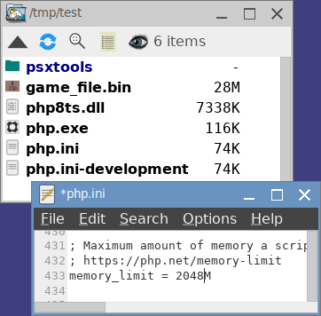

= Steps-by-steps psxtools Tutorial
:toc:

== Setup

The whole setup is very similar to a portable app. It is meant to be carry around on my USB stick to begin with.

First, download PHP v7.0+ from https://windows.php.net/download/[PHP official website]. You'll only need 3 files from the archive, "php.exe", "php7ts.dll/php8ts.dll", and "php.ini" (renamed from "php.ini-development". You doesn't need any PHP extensions.

Put them all to a folder, along with "psxtools" folder from the repo. Edit the "memory_limit" line of php.ini to something higher than "128M".

It will look like this:

`game_file.bin` is the original game file you want to decode.

The result .CLUT and .RGBA are basically raw image files. They can be convert to .BMP or .PNG.
....
php  psxtools/img_clut2bmp.php  .CLUT/.RGBA
php  psxtools/img_clut2png.php  .CLUT/.RGBA
....

Sprites rip in .QUAD format can be open with link:quad_player_mobile/player-mobile.tpl.html[Quad Player]. Individual frames can then be exported from there.

'''
== Xenogears (PS1)

=== Extracting Files

Make sure your Xenogears.bin doesn't have any sector errors. Then run this to convert to ISO/2048 then extract all the files hidden within.
....
php  psxtools/php_bin2iso.php  Xenogears.bin
php  psxtools/xeno_cdrom_img.php  Xenogears.bin.iso
....

=== Converting Files

Refer to link:xenogears/xeno-iso.txt[xeno-iso.txt] for the type of file and run appropriate command
....
File marked [LZ], run "php  psxtools/xeno_decode.php  FILE"
File marked [LZ-PAK], run "php  psxtools/xeno_lzpak_packer.php  lz-pak  FILE"
File marked [PAK-LZ], run "php  psxtools/xeno_lzpak_packer.php  pak-lz  FILE"
....
The following files and folders are known to be sprites, and are rip in .QUAD format.
....
php  psxtools/quad_xeno_battle_2d.php  2335/*all subfiles*
php  psxtools/quad_xeno_battle_2d.php  2617/*all odd subfiles*
php  psxtools/quad_xeno_battle_2d.php  *2988 to 3017*
php  psxtools/quad_xeno_battle_2d.php  3921/*all subfiles*
php  psxtools/quad_xeno_battle_2d.php  3938/*all subfiles*
....
For 426/all subfiles, you'll need to decode them first.
....
php  psxtools/xeno_decode.php  426/*all subfiles*
php  psxtools/quad_xeno_battle_2d.php  426/*all subfiles*
....
For 605/all subfiles, the files are in pairs. Run them in sets.
....
php  psxtools/xeno_map2battle.php  605/EVEN_FILE  605/ODD_FILE
php  psxtools/quad_xeno_battle_2d.php  605/OUTPUT_DIR/spr/*all subfiles*
....

'''
== Rusty (PC-98)

All game files are compressed. Decode them running this first
....
php  psxtools/pc98_rusty_LZ_decode.php  FILES
....
After that you'll need to load the files in certain order to rip them. The order list is commented at the end of respective PHP files.
....
php  psxtools/pc98_rusty_map-tbl-dat.php  bg1.rgb  bg1.map  page3_1r.tbl  page3_1l.tbl  page3_1m.tbl  boss1.tbl  kime.tbl  clear1.tbl
php  psxtools/pc98_rusty_map-tbl-dat.php  bg2.rgb  bg2.map  boss2_r.tbl  boss2_l.tbl  boss2_m.tbl  kime.tbl  clear2.tbl
[...]

php  psxtools/pc98_rusty_mgx.php  r_a11.mgx  r_a11_1.mgx  r_a11_2.mgx  r_a11_3.mgx  r_a11_4.mgx  r_a11_5.mgx  r_a11_6.mgx  r_a11_7.mgx
[...]

php  psxtools/pc98_rusty_mag-ani.php  vs1_01.mag  vs1.ani
php  psxtools/pc98_rusty_mag-ani.php  vs1_02.mag  vs1.ani
[...]
....

'''
== MS Gundam Battle Master series (PS1)

Also known as MS Gundam Battle Assault in US.

For GBM 1 and 2
....
php  psxtools/gbattm2_data_dat_decode.php  data/ms/*.dat
php  psxtools/quad_gbattm2_data_msdat.php  DIR
....
For GBM G and W
....
php  psxtools/gbattmw_data_pac_decode.php  data/ms*.pac
php  psxtools/quad_gbattmw_data_mspac.php  DIR
....
== Gunvolt series (PC)

Game files are packed in .IRLST and .IRARC file pair. Then use the correct IDTAG to convert extracted subfiles to .QUAD format.
....
php  psxtools/pc_gunvolt_irlst-irarc.php  .IRLST

php  psxtools/quad_pc_gunvolt_IOBJ.php  -gv/-gv2/gva/-mgv  OUTPUT_DIR/*all subfiles*
-gv  = Azure Striker Gunvolt IDTAG
-gv2 = Azure Striker Gunvolt 2 IDTAG
-gva = Gunvolt Chronicles Luminous Avenger iX IDTAG
-mgv = Mighty Gunvolt IDTAG
-bmz = Blast Master Zero IDTAG
....

'''
== Vanillaware series

=== Extracting Files

For Grim Grimoire (PS2) and Odin Sphere (PS2), extract the game files from DISC.CVM.
....
php  psxtools/ps2_odin_CVMH_decrypt.php  DISC.CVM
php  psxtools/php_isolist.php  DISC.CVM
....
For Muramasa (Wii), the game files are compressed. Decode them first.
....
php  psxtools/wii_mura_FCMP_decode.php  FILES
....

=== Converting .FTP/.FTX

These are packed texture images file, and was grouped by console.
....
For PS2, run "php  psxtools/ps2_odin_FTEX.php  .FTP"
For PS3, run "php  psxtools/ps3_odin_FTEX.php  .FTX"
For PS4, run "php  psxtools/ps4_13sent_FTEX.php  .FTX"
For PSP, run "php  psxtools/psp_grand_FTEX.php  .FTX"
For Wii, run "php  psxtools/wii_mura_FTEX.php  .FTX"
For NDS, run "php  psxtools/nds_kuma_FTEX.php  .FTX"
For Vita, run "php  psxtools/vita_mura_FTEX.php  .FTX"
....
The result .TM2/.TPL/.GIM/.GXT/.GTF/.GNF are actually .RGBA/.CLUT and can be converted to .BMP or .PNG like so:
....
php  psxtools/img_clut2bmp.php  .TM2/.TPL/.GIM/.GXT/.GTF/.GNF
php  psxtools/img_clut2png.php  .TM2/.TPL/.GIM/.GXT/.GTF/.GNF
....
=== Converting .MBP/.MBS

These are sprite data, and was convert to .V55 format (based on PS2 Odin Sphere FMBP version 0x55) first, then to .QUAD format.
....
php  psxtools/quad_vanillaware_FMBP_FMBS.php  .MBP/.MBS
php  psxtools/quad_vanillaware_v55.php  .V55
....

'''

