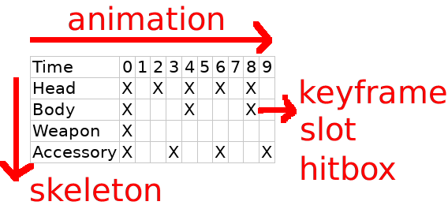

= QUAD Format Specification
Rufas Wan <https://github.com/rufaswan/Web2D_Games/>
v0.5.x , living draft
:hardbreaks-option:
:toc:

== Introduction

QUAD file is mainly for 2D sprites on modern 3D graphics engine. Every drawing is a polygon in square, rectangle, or other quadrilaterals (hence the name QUAD).

The major difference from 2D sprite:

* Instead creating a new drawing for every possible transformation, the sprites can be transform directly using GPU.
* Two transformation can be interpolate during animation. This creates a new type of sprites with 2D doll-like movement.
* If the 2D sprite is properly layered, its depth value can be faked, allowing dynamic lighting and shadow calculations later.
* All indexed color textures will be convert to RGBA true color textures when loading. There are no more palette animations.
* The texture can be in grayscale to be blended with user selected colors. This can be better than editing palettes that edits only 1 color at a time (and that color can be affecting multiple unrelated layers). Blending the whole layer is a lot more convenient, but cost CPU/GPU processing power.
* As everything on GPU is measured in `-1.0 to +1.0` or `0.0 to 1.0`, rounding error is a very common problem.
* Anti-Alias and Smoothing filters are often used to blend the sharp outer edge of 3D models and background. It may not be suitable for 2D pixel art.

The major difference from 3D model:

* It is still animated in frames, instead of using delta time. On a normal 60 FPS (frames per seconds) game, 1 frame is 16.67 milliseconds.
* Z or depth value are not used. It is faked on drawing for perspective correction and drawing order.
* As every polygons are quadrilateral with 4 unique x,y coordinates, indices are not needed. They are auto-generated when drawing as 2 triangles.
* No triangulation needed. The 2 triangles never need to be further broken into smaller triangles.
* Camera Clipping Planes are not used. There are no `near` and `far` in 2D games. Everything within the camera are drawn. Camera is only used for zoom in or out for dramatic effects.
* Full opaque/solid sprites doesn't exists in 2D. There are always transparent/semi-transparent pixels surrounding the sprite, including GUI elements and textbox.
* 3D technique of reducing GPU overdraw by rendering opaque objects front-to-back order is not applicable. All sprites, regardless of opaque/transparent, is rendered in back-to-front order (Painter's algorithm).

== Basic File Structure

A QUAD file consists of multiple sub objects:

* #`keyframe`# defines the drawings of a frame.
* #`hitbox`# defines the areas for collusion detection for a frame.
* #`animation`# defines the changes between frames over time.
* #`skeleton`# defines the relationship between frames.

[#quad_object]
=== Quad Object

[subs="specialchars,macros"]
----
{
  "tag"       : <<tag_object>>,
  "keyframe"  : [
    <<keyframe_object>>,
    <<keyframe_object>>,
    ...
  ],
  "hitbox"    : [
    <<hitbox_object>>,
    <<hitbox_object>>,
    ...
  ],
  "animation" : [
    <<animation_object>>,
    <<animation_object>>,
    ...
  ],
  "skeleton"  : [
    <<skeleton_object>>,
    <<skeleton_object>>,
    ...
  ],
  "slot"      : [
    <<slot_object>>,
    <<slot_object>>,
    ...
  ],
  "blend"     : [
    <<blend_object>>,
    <<blend_object>>,
    ...
  ],
  "link"      : [
    <<link_object>>,
    <<link_object>>,
    ...
  ],
}
----

[#tag_object]
=== Tag Object

It is to define the metadata for current QUAD file.

[subs="specialchars,macros"]
----
{
  tag : [ any , any ... ],
  tag : any,
}
----

For reference, here are some suggestions for tag fields.

MPEG Audio Tag ID3v1 <<mp3tag>>::
* Title
* Artist
* Album
* Year
* Comment
* Genre

ISO9660 -> The Primary Volume Descriptor <<isotag>>::
* System Identifier
* Volume Identifier
* Volume Sequence Number
* Volume Set Identifier
* Publisher Identifier
* Data Preparer Identifier
* Application Identifier
* Copyright File Identifier
* Abstract File Identifier
* Bibliographic File Identifier
* Volume Creation Date and Time
* Volume Modification Date and Time
* Volume Expiration Date and Time
* Volume Effective Date and Time

[#attach_object]
=== Attach Object

Used internally by an object to link with another object.

If invalid, the object is not attached.

[subs="specialchars,macros"]
----
{
  "type" : string tag,
  "id"   : int id,
}

----

type (required)::
	* For linking to other objects in the QUAD file.
	* Valid values are:
	.. `keyframe` for <<keyframe_object>>
	.. `hitbox` for <<hitbox_object>>
	.. `slot` for <<slot_object>>
	.. `animation` for <<animation_object>>
	.. `skeleton` for <<skeleton_object>>

id (required)::
	* Array index to the object.

[#slot_object]
=== Slot Object

Used when more than 1 object need to be attach to a frame.

A frame can consist of a sprite, a hitbox and a sound effect.

[subs="specialchars,macros"]
----
[
  <<attach_object>>,
  <<attach_object>>,
  ...
]
----

[#keyframe_object]
=== Keyframe Object

It is to define a drawing for a frame. The result is an assembled sprite.

[subs="specialchars,macros"]
----
{
  "debug" : any,
  "name"  : string,
  "layer" : [
    <<keyframe_layer_object>>,
    <<keyframe_layer_object>>,
    ...
  ],
  "order" : [
    int layer_id ,
    int layer_id ,
    ...
  ],
}
----

debug::
	* Additional notes and/or comments.

name::
	* Custom string to identify this object.
	* If omitted, then it is default to "keyframe %d".

layer (required)::
	* An array of objects to be drawn for this keyframe.

order::
	* Drawing order for <<keyframe_layer_object>>, in bottom-to-top order (Painter's algorithm).
	* All `layer_id` must be unique within the array, or else it is invalid.
	* If omitted or invalid, then it is default to:
	** `[ 0 , 1 , 2 , ... , layer.length - 1 ]`

[#keyframe_layer_object]
=== Keyframe Layer Object

[subs="specialchars,macros"]
----
{
  "debug"     : any,
  "dstquad"   : [
    number x1 , number y1 ,
    number x2 , number y2 ,
    number x3 , number y3 ,
    number x4 , number y4 ,
  ],
  "blend_id"  : int id,
  "fogquad"   : [ string rgba1 , string rgba2 , string rgba3 , string rgba4 ],
  "fogquad"   : string rgba,
  "attribute" : [ string , string , ... ],
  "attribute" : string,
  "colorize"  : string,
  "tex_id"    : int id,
  "srcquad"   : [
    number x1 , number y1 ,
    number x2 , number y2 ,
    number x3 , number y3 ,
    number x4 , number y4 ,
  ],
}
----

debug::
	* Additional notes and/or comments.

dstquad (required)::
	* Accepts 8 numbers array, or 4 pairs of x,y coordinates.
	* Defines the area on the canvas or background to write pixels to.
	* Measured in pixel (px), with +X is right direction, and +Y is down direction.
	* If omitted, then this layer object is invalid and skipped.

blend_id::
	* Index of <<blend_object>> to use for alpha blending.
	* If <<blend_object>> is invalid or does not exists, then it is skipped.
	* If omitted, then it is default to -1.
	* -1 means disable alpha blending. All pixels, including transparent pixels, will overwrite pixels within `dstquad`.

fogquad::
	* Accepts 4 RGBA strings for 4 corners of a quad.
	** Can be shorthand to 1 RGBA string when all 4 corners are the same color.
	* RGBA string is in "#rrggbbaa" format.
	* If omitted, then it is default to "#ffffffff" (white solid).

attribute::
	* Accepts a string for only 1 attribute, or a list of string for multiple attributes.
	* Used for character customization.
	* Can be used with enum attributes to form an int of bitflags for faster render.

colorize::
	* Accepts a string of custom color name.
	* Used for character customization, by adjusting the HSV (Hue Saturation Value) of a grayscale texture to custom color.
	* Custom color is in RGB, default to `rgb(1.0 , 1.0 , 1.0)`.

tex_id::
	* Required to draw texture.
	* If omitted or it is invalid, then it is default to -1 (draw fog color only)

srcquad::
	* Required to draw texture.
	* Accepts 8 numbers array, as in 4 pairs of x,y coordinates.
	* Defines the area of texture or foreground to read pixels from.
	* Measured in pixel (px), with +X is right direction, and +Y is down direction.
	* If omitted or it is invalid, then fog color only is drawn.

[#hitbox_object]
=== Hitbox Object

It is to define the areas for collusion detection for a frame.

[subs="specialchars,macros"]
----
{
  "debug" : any,
  "name"  : string,
  "layer" : [
    <<hitbox_layer_object>>,
    <<hitbox_layer_object>>,
    ...
  ],
}
----

debug::
	* Additional notes and/or comments.

name::
	* Custom string to identify this object.
	* If omitted, then it is default to "hitbox %d".

layer (required)::
	* An array of hitbox with different properties.

[#hitbox_layer_object]
=== Hitbox Layer Object

[subs="specialchars,macros"]
----
{
  "debug"   : any,
  "hitquad" : [
    number x1 , number y1 ,
    number x2 , number y2 ,
    number x3 , number y3 ,
    number x4 , number y4 ,
  ],
  "attribute" : [ string , string , ... ],
  "attribute" : string,
}
----

debug::
	* Additional notes and/or comments.

hitquad (required)::
	* Accepts 8 numbers array, or 4 pairs of x,y coordinates.
	* Defines the area for collusion detection.
	* Measured in pixel (px), with +X is right direction, and +Y is down direction.
	* If omitted, then this layer object is invalid and skipped.

attribute::
	* Accepts a string for only 1 attribute, or a list of string for multiple attributes.
	* Can be used with enum attributes to form an int of bitflags for faster collusion detection.

[#animation_object]
=== Animation Object

It is to define the *changes* between frames over time.

[subs="specialchars,macros"]
----
{
  "debug"    : any,
  "name"     : string,
  "timeline" : [
    <<animation_timeline_object>>,
    <<animation_timeline_object>>,
    ...
  ],
  "loop_id"  : int id,
}
----

debug::
	* Additional notes and/or comments.

name::
	* Custom string to identify this object.
	* If omitted, then it is default to "animation %d".

timeline (required)::
	* An array of objects to be drawn in sequence.

loop_id::
	* Marks the array index for next frame when timeline reaches the end.
	* Value `0` (zero) restarts from the beginning.
	* If omitted, then it is default `-1` (no loop).

[#animation_timeline_object]
=== Animation Timeline Object

[subs="specialchars,macros"]
----
{
  "debug"        : any,
  "time"         : int fps,
  "attach"       : <<attach_object>>,
  "matrix"       : [ a,b,c,d , e,f,g,h , i,j,k,l , m,n,o,p ],
  "color"        : string rgba,
  "matrix_mix"   : bool,
  "color_mix"    : bool,
  "keyframe_mix" : bool,
  "hitbox_mix"   : bool,
}
----

debug::
	* Additional notes and/or comments.

time (required)::
	* Measured in frames. For 60 FPS (frames per second), 1 frame is 16.67 milliseconds.

attach::
	* If omitted, then nothing is drawn.

matrix::
	* A 4x4 transformation matrix.
	* If omitted, then it is default to 4x4 identity matrix.

color::
	* String is in "#rrggbbaa" format.
	* If omitted, then it is default to "#ffffffff" (white solid).

matrix_mix::
	* Marks if current matrix is interpolated with the next matrix.
	** rate = t / time , t++
	** matrix = (current * (1.0 - rate)) + (next * rate)
	* If omitted, then it is default to `0` (`false`)

color_mix::
	* Marks if current color is interpolated with the next color.
	** rate = t / time , t++
	** color = (current * (1.0 - rate)) + (next * rate)
	* If omitted, then it is default to `0` (`false`)

keyframe_mix::
	* Marks if current <<keyframe_layer_object>> is interpolated with the next <<keyframe_layer_object>>.
	* Affects `dstquad` and `fogquad`.
	** rate = t / time , t++
	** layer = (current * (1.0 - rate)) + (next * rate)
	* If omitted, then it is default to `0` (`false`)
	** Mixing is impossible under the following conditions, and this setting is default to `0` (`false`).
	*** If current keyframe layer count is not the same as next keyframe layer count.
	*** If current keyframe layer is empty.
	*** If next keyframe layer is empty.
	** If `false`, only current keyframe layer is used, next keyframe layer is ignored.

hitbox_mix::
	* Marks if current <<hitbox_layer_object>> is interpolated with the next <<hitbox_layer_object>>.
	* Affects `hitquad`.
	** rate = t / time , t++
	** layer = (current * (1.0 - rate)) + (next * rate)
	* If omitted, then it is default to `0` (`false`)
	** Mixing is impossible under the following conditions, and this setting is default to `0` (`false`).
	*** If current hitbox layer count is not the same as next hitbox layer count.
	*** If current hitbox layer is empty.
	*** If next hitbox layer is empty.
	** If `false`, only current hitbox layer is used, next hitbox layer is ignored.

[#skeleton_object]
=== Skeleton Object

It is to define the *relationship* between frames.

[subs="specialchars,macros"]
----
{
  "debug" : any,
  "name"  : string,
  "bone"  : [
    <<skeleton_bone_object>>,
    <<skeleton_bone_object>>,
    ...
  ],
}
----

debug::
	* Additional notes and/or comments.

name::
	* Custom string to identify this object.
	* If omitted, then it is default to "skeleton %d".

bone (required)::
	* An array of bones to built the skeleton.

[#skeleton_bone_object]
=== Skeleton Bone Object

[subs="specialchars,macros"]
----
{
  "debug"     : any,
  "name"      : string,
  "attach"    : <<attach_object>>,
}
----

debug::
	* Additional notes and/or comments.

name::
	* Custom string to identify this object.
	* If omitted, then it is default to "skeleton bone %d".

attach::
	* If omitted, then it is invisible bone and drawing is skipped.

[#blend_object]
=== Blend Object

It is to define alpha blending formula to handle transparency and semi-transparency pixels.

[subs="specialchars,macros"]
----
{
  "debug"      : any,
  "name"       : string,
  "mode_rgb"   : [ string mode , string src_factor , string dst_factor ],
  "mode_alpha" : [ string mode , string src_factor , string dst_factor ],
  "color"      : string rgba,
  "logic_op"   : [ string opcode_r   , string opcode_g , string opcode_b , string opcode_a ],
  "logic_op"   : [ string opcode_rgb , string opcode_a ],
  "logic_op"   : string opcode,
}
----

debug::
	* Additional notes and/or comments.

name::
	* Custom string to identify this object.
	* If omitted, then it is default to "blend %d".

mode_rgb (required)::
	* Accepts a 3 strings array
	** `mode` is enum for `blendEquation()`, and string can be case-insensitive.
	*** `FUNC_ADD` is math operation `SRC + DST`
	*** `FUNC_SUBTRACT` is math operation `SRC - DST`
	*** `FUNC_REVERSE_SUBTRACT` is math operation `-SRC + DST`
	***  `MIN` is `min(SRC.r, DST.r)`,  `min(SRC.g, DST.g)`,  `min(SRC.b, DST.b)` and `min(SRC.a, DST.a)`
	***  `MAX` is `max(SRC.r, DST.r)`,  `max(SRC.g, DST.g)`,  `max(SRC.b, DST.b)` and `max(SRC.a, DST.a)`
	** `src_factor` and `dst_factor` are enum for `blendFunc()`, and string can be case-insensitive.
	*** Static value
	**** `ZERO` is value `0.0`
	**** `ONE` is value `1.0`
	*** SRC or Foreground (top layer)
	**** `SRC_COLOR`
	**** `SRC_ALPHA`
	**** `ONE_MINUS_SRC_COLOR`
	**** `ONE_MINUS_SRC_ALPHA`
	*** DST or Background (bottom layer)
	**** `DST_COLOR`
	**** `DST_ALPHA`
	**** `ONE_MINUS_DST_COLOR`
	**** `ONE_MINUS_DST_ALPHA`
	*** CONSTANT  (require `color` below)
	**** `CONSTANT_COLOR`
	**** `CONSTANT_ALPHA`
	**** `ONE_MINUS_CONSTANT_COLOR`
	**** `ONE_MINUS_CONSTANT_ALPHA`

mode_alpha::
	* same format as `mode_rgb` above
	* if omitted, then it is the same as `mode_rgb`

color::
	* required only if `src/dst_factor` uses CONSTANT
	* String is in "#rrggbbaa" format.
	* If omitted, then it is default to "#ffffffff" (white solid).

logic_op::
	* Has higher priority than normal blending. Hence when it is set, `mode_rgb`, `mode_alpha` and `color` are ignored.
	* Accepts 4 strings array for each RGBA components.
	** Can be shorthand to 2 string for RGB and Alpha components.
	** Can be shorthand to 1 string for all 4 RGBA components.
	** `opcode` is enum for `logicOp()`, and string can be case-insensitive.
	*** `CLEAR` as value 0
	*** `SET` as value 1
	*** `COPY` as bitwise operation `SRC`
	*** `COPY_INVERTED` as bitwise operation `~SRC`
	*** `NOOP` as bitwise operation `DST`
	*** `INVERT` as bitwise operation `~DST`
	*** `AND` as bitwise operation `SRC & DST`
	*** `NAND` as bitwise operation `~(SRC & DST)`
	*** `OR` as bitwise operation `SRC | DST`
	*** `NOR` as bitwise operation `~(SRC | DST)`
	*** `XOR` as bitwise operation `SRC ^ DST`
	*** `EQUIV` as bitwise operation `~(SRC ^ DST)`
	*** `AND_REVERSE` as bitwise operation `SRC & ~DST`
	*** `AND_INVERTED` as bitwise operation `~SRC & DST`
	*** `OR_REVERSE` as bitwise operation `SRC | ~DST`
	*** `OR_INVERTED` as bitwise operation `~SRC | DST`
	* Logic Operation can only be used for integer draw buffer. It invalid for floating-point draw buffer.
	* If omitted or invalid, then it is default to `0` (use normal blending).

[#link_object]
=== Link Object

It is to connect with another QUAD file, allowing interaction between QUAD files.

[subs="specialchars,macros"]
----
{
  "list" : pointer,
  "id"   : int id,
}
----

list (required)::
	* Pointer to array of QUAD files.

id (required)::
	* Array index to the QUAD file.

== Revision History

v0.5.x::
	* `keyframe_layer_object` : define `blend_id` == -1 as disable alpha blending
	* `blend_object` : separate `mode` into `mode_rgb` and `mode_alpha`
	* `blend_object` : added `logic_op`

v0.5 (2024-4-3)::
	* `quad_object` : renamed to `link_object`
	* `keyframe_layer_object` : added `colorize`
	* `keyframe_layer_object` : added `attribute`
	* `hitbox_layer_object` : added `attribute`

v0.4 (2024-1-11)::
	* `keyframe_object` : added `order`
	* `skeleton_bone_object` : removed `order`
	* `skeleton_bone_object` : removed `parent_id`

v0.3 (2023-11-06)::
	* `animation_timeline_object`: removed `mix`
	* `animation_timeline_object`: added `matrix_mix`
	* `animation_timeline_object`: added `color_mix`
	* `animation_timeline_object`: added `keyframe_mix`
	* `animation_timeline_object`: added `hitbox_mix`

v0.2 (2023-05-11)::
	* Rewritten from scratch with dynamic `attach_object` system.
	* Object keys are standardize to be singular form in `lower_snake_case`.
	* Added `hitbox` objects.
	* Added `slot` objects.
	* Added `skeleton` objects.
	* Added `blend` objects.
	* `animation` object is simplified to one-track only.

v0.1 (2021-03-01)::
	* Initial release and first draft.

== Terminology

SRC::
	* As in "Source", pixels READ from texture.
	* On image editor, it is the top layer.
	* [U,V] is used when accessing vectors that represent texture coordinates.
	* 0,0 is at top-left of texture.
	* +X is right direction, +Y is down direction, and they are measured in px (pixels).
	* For Texture size 320x240, X is 0px (left) to 320px (right) , and Y is 0px (top) to 240px (bottom).
	* It is then normalized to 0.0 to 1.0.

DST::
	* As in "Destination", pixels WRITE to canvas.
	* On alpha blending operation, pixels are READ and WRITE back to canvas.
	* On image editor, it is the bottom layer.
	* [X,Y] is used when accessing vectors that reporesent canvas points.
	* 0,0 is at the center of canvas.
	* +X is right direction, +Y is down direction, and they are measured in px (pixels).
	* For Canvas size 320x240, X is -160px (left) to +160px (right) , and Y is -120px (top) to +120px (bottom).
	* It is then normalized to -1.0 to +1.0.

== Example

* link:sample-v0.3-animation-keyframe-mix.quad[]
* link:sample-v0.3-animation-matrix-mix.quad[]
* link:sample-v0.4-keyframe-order.quad[]
* link:sample-v0.5-keyframe-attribute.quad[]
* link:sample-v0.5-keyframe-colorize.quad[]
* link:sample-concave.quad[]

== Contributors

In alphabetical order::
	* Cloud2333
	* tombmonkey

== Links

Online Ver::
* https://github.com/rufaswan/Web2D_Games/blob/master/docs/quad_player_mobile/spec.adoc
* https://rufaswan.github.io/Web2D_Games/quad_player_mobile/spec.html

Extra Readings::
* https://asciimath.org/
* [[[mp3tag]]] https://web.archive.org/web/20241209074817/http://mpgedit.org/mpgedit/mpeg_format/mpeghdr.htm#MPEGTAG
* [[[isotag]]] https://web.archive.org/web/20241231230351/https://wiki.osdev.org/ISO_9660
* [[[psftag]]] https://web.archive.org/web/20060420042053/http://www.neillcorlett.com/psf/psf_format.txt
* [[[json5]]]  https://spec.json5.org/
