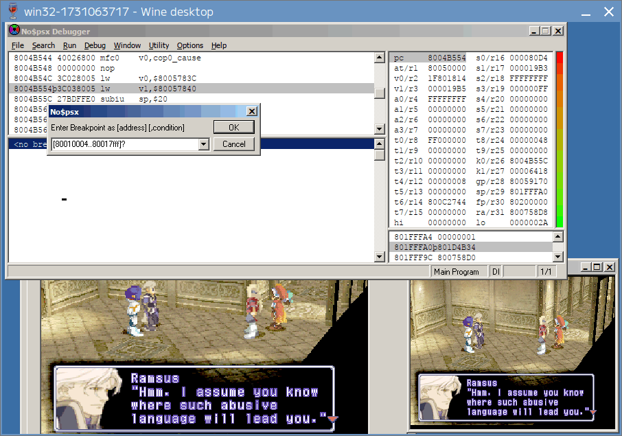
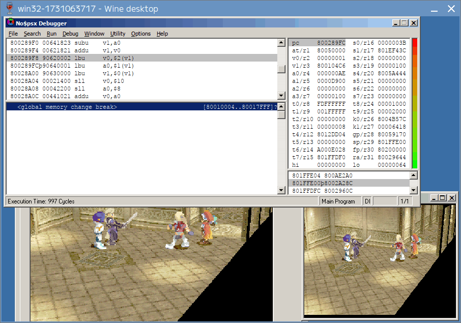

= Margie Healing Tutorial
Rufas Wan <https://github.com/rufaswan/Web2D_Games/>
v2.0 , 2024-12-28
:toc:

This is a simple tutorial to look for Margie's Healing Spell Value.

== Setup

For a start, we have no idea what value to look for, but we *do know* what the spell do:

. It targets an ally.
. It heals 40 HP. The target gains +40 HP as a result.

So we'll use Bart vs Ramsus battle at Aveh Palace. Since we are looking for the *source* data, we'll make 3 save states to rollback to:

. A save state on Margie's room. We'll call it #BEFORE MAP state#.
. A save state in the middle of dialog, right before the battle starts. We'll call it #BEFORE BATTLE state#.
. A save state before Margie's turn. We'll call it #BEFORE TURN state#.

There is only one playable character during the fight, so we only need to monitor Bart's HP until Margie heals him.

There are many ways to locate Bart's HP.

. If you emulator has "cheat search" or "memory search" function (e.g. mednafen), you can use that.
. You can use Cheat Engine to scan for the value, but the result address is for the emulator, so you'll need to do some math to adjust it back.
. You can also find it by opening *uncompressed* save states with any hex editor. Similar to Cheat Engine above, you also need to do some adjustment to the result address.
. But unlike Cheat Engine, save state is a normal file. You can extract the RAM part to a new file first and avoid the need to do math later.

== Backtracing For A Value

In any case, Bart's HP is at `RAM 800ccd34` duing battle. Put a WRITE breakpoint there, you'll get this on Margie's turn.

image::margie-heal-1.png[link=margie-heal-1.png,height=240]

....
at = d0000 + s0 - 32cc
   = d0000 + 0 - 32cc
   = ccd34
v0 = (int16)(*RAM + ccd34)
v1 = (int16)*s3
   = (int16)(*RAM + c4078)
v0 += v1
at = 10000 + s4 - 717c
   = 10000 + c3eb0 - 717c
   = ccd34
(int16)(*RAM + ccd34) = v0
....

So `v0` is Bart's HP, and `v1` is Margie's +40 HP healing we are looking for. It is loaded from `s3`.

Load back #BEFORE TURN state# and put a WRITE breakpoint on `RAM 800c4078` to see where it came from.

image::margie-heal-2.png[link=margie-heal-2.png,height=240]

The value is copied from `t0`. Again, load back #BEFORE TURN state# and put a WRITE breakpoint on `RAM 800d2c54` to backtrace it.

image::margie-heal-3.png[link=margie-heal-3.png,height=240]

Now here is the tricky part. The `pc` has already "returned", but no$psx is nice enough to stay on the delay slot.

Looking at `v0`, it still holding 0x28. And from the instruction above, `v0` is `(a1 << 10) >> 10` (the bit shift are a common ASM trick to turn unsigned int to signed int).

Let scroll upward to discover how `a1` is calculated.

image::margie-heal-4a.png[link=margie-heal-4a.png,height=240]

As you scrolling up, you'll keep seeing `a1` is from `v1` and `v0`, but then `v1` is from `a1`, and `v0` is from `v1`. So it's a bunch of nothing.

Eventually, you'll reach this part, where `a1` is `v1 * v0`, and `v1` and `v0` are values loaded from somewhere else.

IMPORTANT: Bookmark this ASM address!

Following `v1`, we follow the pointer at `a0`, and reached `RAM 800cd138 + 5b`, we get the value 2. Looking at the data struct, it seems like character stats. Margie has Ether = 2.

image::margie-heal-4b.png[link=margie-heal-4b.png,height=240]

Following `v0`, we follow the pointer at `v0`, and reached `RAM 800d0388 + 11`, we get the value 0x14.

#IT FITS!# 2 * 0x14 = 0x28. So the formula is Margie's Ether 2 * Spell Power 0x14 = 0x28 HP Heal!

Now we are getting somewhere! Load back #BEFORE TURN state# and put a WRITE breakpoint here to see where 0x14 came from!

image::margie-heal-5b.png[link=margie-heal-5b.png,height=240]

Unfortunately the breakpoint didn't triggered. It means the data wasn't update during the battle.

It also means we need to go further back to #BEFORE BATTLE state# and re-trigger the battle from the start.

Indeed, the breakpoint is triggered! The 0x14 is copied from `a1`.

Load back #BEFORE BATTLE state# again and put (yet another) WRITE breakpoint at `RAM 801c3f7a`

image::margie-heal-6b.png[link=margie-heal-6b.png,height=240]

And now we find ourself reading decompression code. `a0` is the pointer to original compressed data, loaded directly from BIN/CUE.

You can use this data to find the correct game file from the disc.

== Locating the Relevant Files

Xenogears looks for its game files by LBA (Logical Block Address) or CD sector address. The list of LBA for the whole game is on SLPS/SLUS main executable at offset 0x804 to 0x8800. It is then loaded to RAM at 0x80010004 to 0x80018000. So we put an READ breakpoint to the entire area.

The LBA list is 7 bytes per entry. Byte 0,1,2 is an int24 for LBA, and byte 3,4,5,6 is an int32 for its filesize. If the filesize is negative, then the entry is an directory.

Basically, the ASM is checking if it is going to load a subfile. You can ignore lbu (load byte unsigned) instructions when it is on byte 3,4,5,6.

Byte 0,1,2 is the actual attempt to load the file. The value you need to take note is `v1`, and it has value 0x800104c6.

With that, we can use this formula to calculate the file id

----
(v1 - entry start) / entry size
= (800104c6 - 80010004) / 7
= 0174.bin
----

CAUTION: Make sure there are no remainder after the divide!

Noting down every `v1` starting from #BEFORE MAP state# until Margie heals Bart. The content of each file is then identified by referring to `xeno-iso.txt` as notes.

|===
|v1       |file |notes

3+h|BEFORE MAP state
|800118e6 | 910 |map data    - map 152  Aveh Palace
|800118ed | 911 |map texture - map 152  Aveh Palace

3+h|Map fully loaded. Player in control.

3+h|Cutscene triggered
|80010e2e | 518 |Face - Margie
|80010dfd | 511 |Face - Bart
|80010e04 | 512 |Face - Bart
|80010ea5 | 532 |Face - Ramsus

3+h|BEFORE BATTLE state
|800104c6 | 174 | wds/sample data - bgm 20  Crimson Knight
|800104cd | 175 |smds/midi   data - bgm 20  Crimson Knight
|8001010e |  38 |[LZ][OVER] Battle executable
|80014777 |2613 |seds
|8001477e |2614 |[PAK-LZ] Data
|80014785 |2615 |[OVER]
|80014a10 |2708 |  stats/name      - mon 45  Miang, Ramsus, Margie, Fei
|80014a17 |2709 |texture/animation - mon 45  Miang, Ramsus, Margie, Fei

3+h|Battle Transition Effect start
|80014c9b |2801 |3d model data
|80014ca2 |2802 |3d model data

3+h|Battle Transition Effect end
|800151c6 |2990 |Bart battle sprites
|8001543c |3080 |[PAK]
|80015443 |3081 |[PAK]
|8001544a |3082 |seds
|8001546d |3087 |[OVER]
|80015474 |3088 |[PAK-LZ]
|8001547b |3089 |[PAK-LZ]
|80015482 |3090 |seds
|80015458 |3084 |wds/sample data

3+h|pre-Battle Dialogue
|80010e9e | 534 |Face - Miang
|80010e04 | 512 |Face - Bart
|80010e2e | 518 |Face - Margie
|80010e9e | 534 |Face - Miang
|8001532b |3041 |seds
|80015332 |3042 |wds/sample data
|80010e04 | 512 |Face - Bart
|80010ea5 | 535 |Face - Ramsus
|80010dfd | 511 |Face - Bart
|80010e2e | 518 |Face - Margie
|80010dfd | 511 |Face - Bart

3+h|Battle fully loaded. Player in control.

3+h|BEFORE TURN state
|80015466 |3086 |wds/sample data
|80015458 |3084 |wds/sample data
|8001523d |3007 |Bart battle sprites - Deathblows
|===

And with that, we have limit our search from the whole game 3700+ files to about 40 files.

Checking the files between "BEFORE BATTLE state" and "pre-Battle Dialogue", excluding any known irrelevant files, I can get a match on file 2614.bin , offset 0x7022.

There might be duplicates on other game files. You can use this method to find them. If you cannot trigger certain file to load no matter what you do, most likely that file is a leftover dummy.

== Potential Bug

image:heal-200-margie.png[link=heal-200-margie.png,height=240]
image:heal-200-miang.png[link=heal-200-miang.png,height=240]

When I changed the spell value from 20 to 100, I noticed not only Margie heals Bart 200 HP, but Miang also heals Ramsus 200 HP.

Apparently both Margie and Miang are using the same spell. It may not be what you want, but that's whole another story on fixing it.

Hope it helps!
