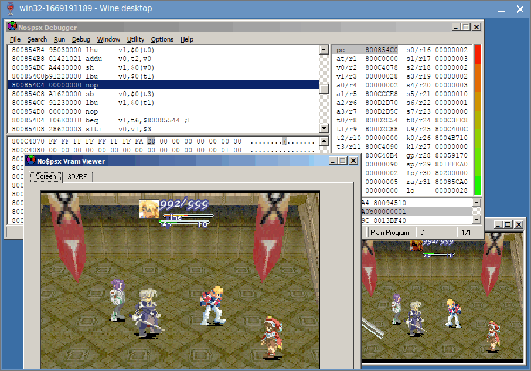
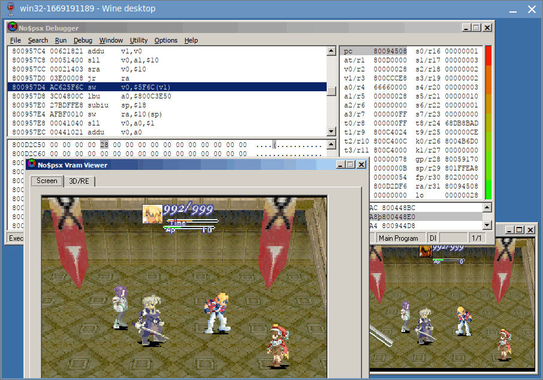
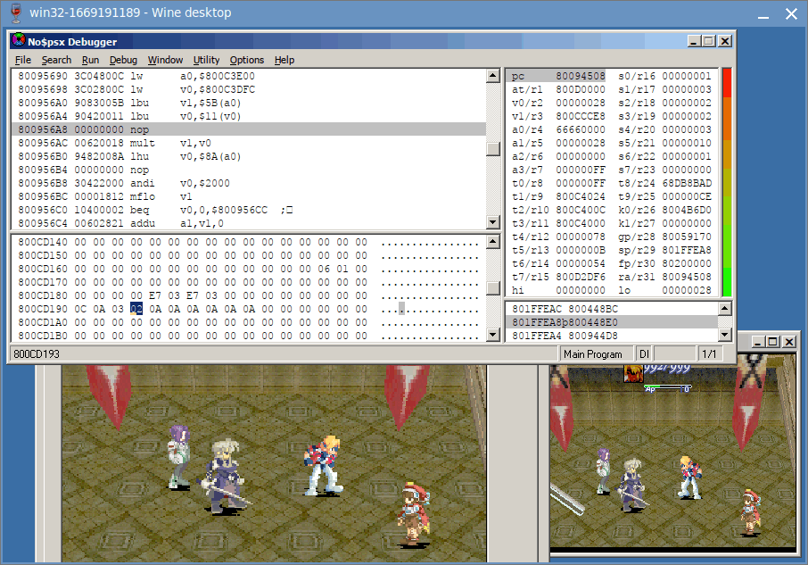
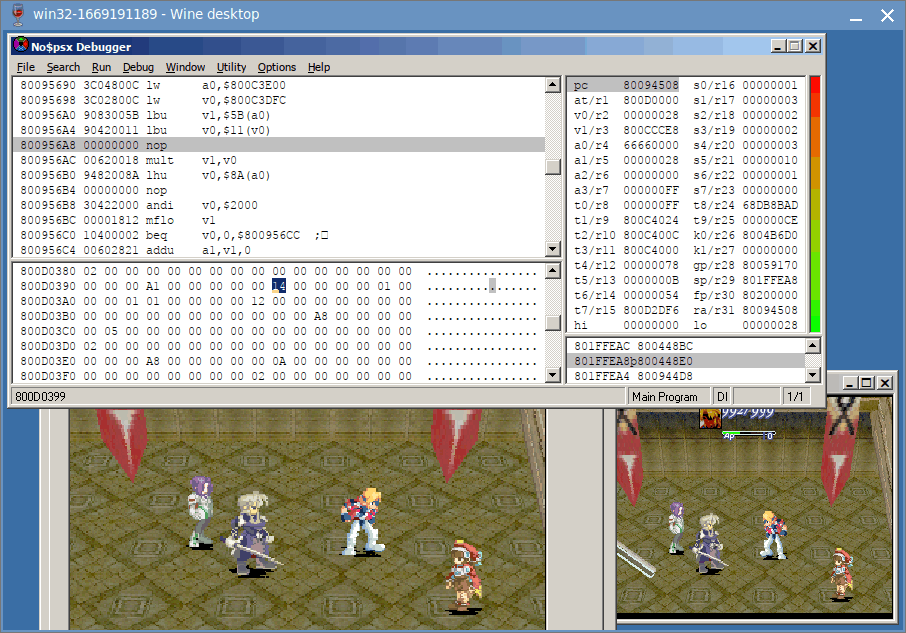
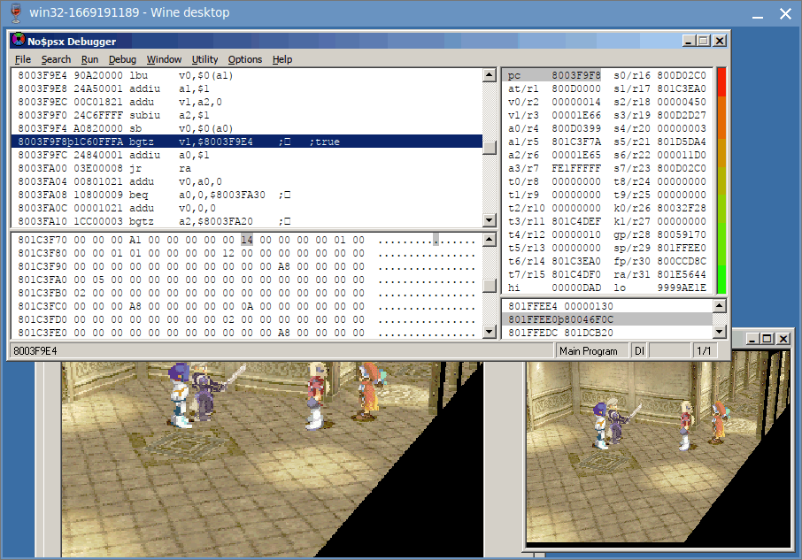
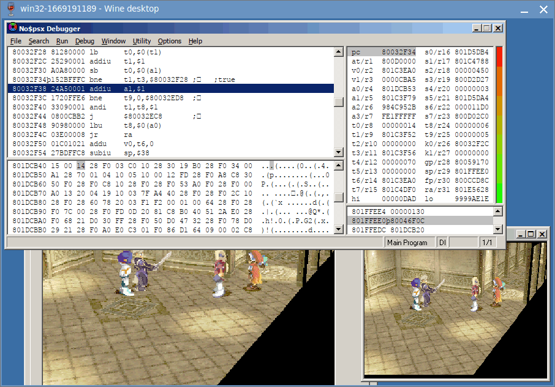
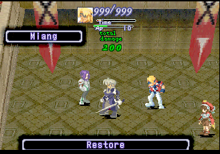

# Margie Healing Tutorial

This is a simple tutorial to look for Margie's Healing Spell Value.

For a start, we have no idea what value to look for, but we **DO know** what the spell do:

. It heals 40 HP.
. The target gains +40 HP as a result.

So we'll use Bart vs Ramsus battle at Aveh Palace. Since we are looking for the *source* data, we'll make 3 save states to rollback to:

. A save state on Margie's room. We'll call it *"BEFORE MAP state"*
. A save state in the middle of dialog, right before the battle starts. We'll call it *"BEFORE BATTLE state"*
. A save state before Margie's turn. We'll call it *"BEFORE TURN state"*

There is only one playable character during the fight, so we only need to monitor Bart's HP until Margie heals him.

There are many ways to locate Bart's HP.

. If you emulator has "cheat search" function (e.g. mednafen), you can use that.
. You can also find it by opening **uncompressed** save states with any hex editor. You'll want to know where RAM 80010000 is located within the save state, and then adjust the search result accordingly.
. Or you can export the RAM part to a new file, if you don't want the trouble to use a calculator everytime.

In any case, Bart's HP is at RAM 800ccd34 duing battle. Put a WRITE breakpoint there, you'll get this on Margie's turn.

....
at = d0000 + s0 - 32cc
   = d0000 + 0 - 32cc
   = ccd34
v0 = (int16)(*RAM + ccd34)
v1 = (int16)*s3
   = (int16)(*RAM + c4078)
v0 += v1
at = 10000 + s4 - 717c
   = 10000 + c3eb0 - 717c
   = ccd34
(int16)(*RAM + ccd34) = v0
....

So `v0` is Bart's HP, and `v1` is Margie's +40 HP healing we are looking for. It is loaded from `s3`.

Load back BEFORE TURN state and put a WRITE breakpoint on RAM 800c4078 to see where it came from.

The value is copied from `t0`. Again, load back BEFORE TURN state and put a WRITE breakpoint on RAM 800d2c54 to backtrace it.

Now here is the tricky part. The `pc` has already "returned", but no$psx is nice enough to stay on the delay slot.

Looking at `v0`, it still holding 0x28. And from the instruction above, `v0` is `(a1 << 10) >> 10` (the bit shift are a common ASM trick to turn unsigned int to signed int).

Let scroll upward to discover how `a1` is calculated.

As you scrolling up, you'll keep seeing `a1` is from `v1` and `v0`, but then `v1` is from `a1`, and `v0` is from `v1`. So it's a bunch of nothing.

Eventually, you'll reach this part, where `a1` is `v1 * v0`, and `v1` and `v0` are values loaded from somewhere else. **BOOKMARK THIS**

Following `v1`, we follow the pointer at `a0`, and reached RAM 800cd138 + 5b, we get the value 2. Looking at the data struct, it seems like character stats. Margie has Ether = 2.

Following `v0`, we follow the pointer at `v0`, and reached RAM 800d0388 + 11, we get the value 0x14.

**IT FITS!** 2 * 0x14 = 0x28. So the formula is Margie's Ether 2 * Spell Power 0x14 = 0x28 HP Heal!

Now we are getting somewhere! Load back BEFORE TURN state and put a WRITE breakpoint here to see where 0x14 came from!

Unfortunately the breakpoint didn't triggered. It means the data doesn't update during the battle.

It also means we have go further back to BEFORE BATTLE state and re-trigger the battle from the start.

Indeed, the breakpoint is triggered! The 0x14 is copied from `a1`.

Load back BEFORE BATTLE state again and put (yet another) WRITE breakpoint at RAM 801c3f7a

And now we find ourself reading decompression code. `a0` is the pointer to original compressed data, loaded directly from BIN/CUE.

You can use this data to find the correct game file from the disc.

There are also many ways to do it:

. Extract all files to a folder, then write a custom tool to loop through all files for a match.
. Remove all ECC/ECM data by convert the BIN/CUE to normal 2048 iso. Find the bytes pattern with a hex editor, and then use Xenogears TOC (it has file offset and file size) to see which file the search result landed between.

And with that, I located the file is 2614.bin , offset 0x7022.

## Potential Bug

image:heal-200-margie.png[link=heal-200-margie.png,320,240]

When I changed the spell value from 20 to 100, I noticed not only Margie heals Bart 200 HP, but Miang also heals Ramsus 200 HP.

Apparently both Margie and Miang are using the same spell. It may not be what you want, but that's whole another story on fixing it.

Hope it helps!

_Rufas_
