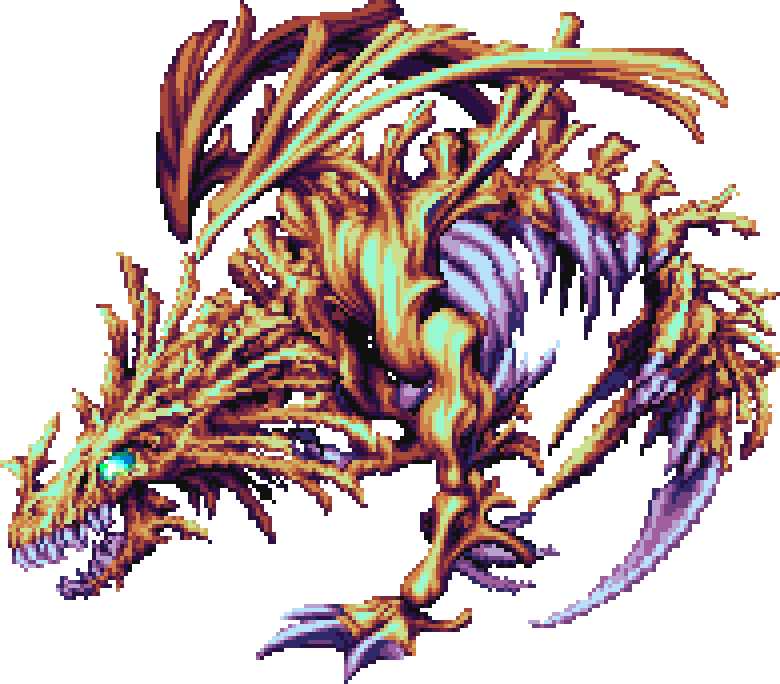

:ghrepo: http://github.com/rufaswan/Web2D_Games
:ghpage: http://rufaswan.github.io/Web2D_Games

Server-side scripts. Mainly for desktop and run in command line (CMD.exe for Windows, and bash for Linux/Mac).

== PHP

=== include/require Rule

Named with 2 file extensions - \*.inc and \*.php

\*.inc is to be `include` or `require` by \*.php , and has functions or class only. It doesn't have any executable code.

* \*.inc MUST NOT include another \*.inc
** do not make it into a recursive include loop
* \*.inc MUST NOT include \*.php
** no executable code
* \*.inc MUST NOT use `echo` and `printf`
** do not clutter user debug output

\*.php are executable command-line script for php-cli. They are independant of each other.

* \*.php MUST NOT include other \*.php
* \*.php CAN include multiple \*.inc , and in correct order

=== Script Naming Scheme

All script follows this naming scheme

....
{magic}_{console}_{game}_{name}_{function}.php
....

magic::
	* Magic Identifier of the binary file.
	* It is fixed. Basically you'll `fread()` a binary string at certain offset and at certain length, and then `strcmp()` to identify them.
	* Normally it is the first 4 byte of the file, and in uppercase alpha-numeric characters, eg "RIFF", "GIF87a", "RGBA", etc.
	* Prefer the length at least 4 bytes to prevent false positives.
	* As such files can be auto-detect with relatively high consistancy, the script will also accept dir as INPUT and recursively loop through every files within it.

console::
	* Specify the game console where we get the game files from.
	* Has special handler functions to read the game files, eg swizzling code, big endian byte order, RGB555/RGB565/RGB555A1 color decode, etc
	* REQUIRE if the game has multi-platform releases.
	* list
	** psx   = PlayStation
	** ps2   = PlayStation 2
	** ps3   = PlayStation 3
	** ps4   = PlayStation 4
	** ps5   = PlayStation 5
	** psp   = PlayStation Portable
	** vita  = PlayStation Vita
	** sat   = Sega Saturn
	** nds   = Nintendo DS
	** wii   = Nintendo Wii
	** xbsx  = XBox Series S/X
	** pc98  = NEC PC9801
	** pc    = Generic PC

game (required)::
	* REQUIRE 8 ASCII chars to abbreviate the game name
	* MUST be unique and not get confused with another game with similar name.

name::
	* OPTIONAL if already has magic identifier.
	* Uses anything related to the file for identification, including file extension, the dir name of the files, or both.
	* example
	** "game_ext" = for all ".ext" files.
	** "game_dir_ext" = for all ".ext" files under "dir" folder.
	** "game_idx-pak" = naming scheme when 2 or more file works together as a set
	*** will accepts "game.idx" or "game.pak" as input
	*** internally will set the input as "game", and then load both "game.idx" and "game.pak" together.
	** "game_dir_idx-pak" = same as "game_idx-pak" above + under "dir" folder
	** "game_idx-pak-upd" = same as "game_idx-pak" above, except it is 3 files "game.idx", "game.pak" and "game.upd" as a set
	** "game_dir_idx-pak-upd" = like "game_idx-pak-upd" above + under "dir" folder

function (require)::
	* The main function or purpose of the script
	* list
	** decode = to decompress or decrypt the files
	*** INPUT is always a file.
	*** will always decode from INPUT.bak
	*** if INPUT.bak do not exists, copy INPUT to INPUT.bak
	*** decoded data will overwrite INPUT
	** packer = handler for virtual file system
	*** if INPUT is a dir, pack all files under INPUT to a file (like zip)
	*** if INPUT is a file, unpack all files to its own dir (like unzip)
	** x2y or x_to_y = to decode file from X format to Y format
	*** INPUT is always a file
	*** eg `clut2png`, or `v55_to_quad`

=== Convert to QUAD File

Instead of export to CLUT or RGBA raw image files, QUAD file is used when data cannot be 100% preserved when export as raw image.

This includes

* Image uses blending mode other than "Normal", eg "Addition", "Subtraction", "Multiply", "Average", etc.
* Image uses transformation, including zoom in (enlarge), zoom out (shrink) and rotation (in x, y, and z axis).

==== Blending Modes

The common "Normal" blending mode uses this formula

....
Result = (SRC.rgb * SRC.a) + (DST.rgb * (1.0 - SRC.a))
....

However retro games has only Red-Green-Blue channels, and do not have Alpha channel. The common blending mode is "Addition" instead

....
Result = SRC.rgb + DST.rgb
....

RGB for both pixels are add together. Black color rgb(0,0,0) will result no change, so they are like transparent pixel.

If uncheck, "Addition" can result rgb(255,255,255) easily and the whole screen become plain white color (over-exposed). For this reason, the number of SRC used will need to be under control, and SRC itself is normally close to black color or under rgb(64,64,64).

.Result with incorrect "Normal" blending
image::psx-panzer-zako06-normal.png

.Result with correct "Addition" blending
image::psx-panzer-zako06-add.png

Therefore, in order to correct export the image, you have to either

. export each blending as its own raw image
. export everything in SRC in a texture atlas, with a text file to note down the correct blending formula to use.

For (1), you'll still have problem about layer ordering (the light is on top of face layer, but below hand layer)

For (2), that is the QUAD file on this repo.

==== Transformation

With transformation, the pixels are written at different position. Some are duplicated, and some are skipped. The result is no longer the same as original anymore.

Using QUAD file, the original SRC is preserved. It will know it is rendering a straight line because it has SRC (a straight line) for reference.

.Result when directly render at 4x

If you pre-rendered it first (as spritesheet) then upscale to 4x later, the original SRC is already lost. The upscale code will need to auto-detect the image for a straight line.

.Result when render at 1x, but later upscale it to 4x

Noticed the quality difference? The directly render at 4x is so much smoother and less blockier.

=== No Namespace

----
namespace sh;
function mkdir() : void
{
	...
	mkdir($cmd);  // FATAL = becomes \sh\mkdir(); infinite loop
	\mkdir($cmd); // OK    = should be PHP core mkdir();
	...
}
----

If you made your own `mkdir()`, PHP will always use `\sh\mkdir()` instead `\mkdir()`.

It will become confusing for people who read only the relevant part of the code.

Make it obvious `mkdir()` is your own version, not from PHP core
