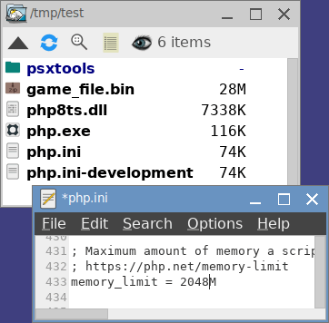

:ghrepo: http://github.com/rufaswan/Web2D_Games
:ghpage: http://rufaswan.github.io/Web2D_Games

= Steps-by-steps psxtools Tutorial
Rufas Wan <https://github.com/rufaswan/Web2D_Games/>
:toc:

== Setup

The whole setup is very similar to a portable app. It is meant to be carry around on my USB stick to begin with.

=== PHP for Windows
First, download PHP v7.1 and above from PHP Official Site:

* https://windows.php.net/downloads/ (latest)
* https://windows.php.net/downloads/releases/archives/ (for older Windows, need older Visual C++ RunTime (vcrun))

Extract these 3 files from the archive

* php.exe
* php7ts.dll or php8ts.dll
* php.ini (renamed from php.ini-development)
** edit the value for 'memory_limit' from `128M` to a higher value, e.g. `2048M`

=== Compiled PHP from source
You can also compile PHP directly from release source https://www.php.net/releases/ . You will need PHP v7.1 and above.

I compile minimal PHP by default. This is to ensure all .PHP under `riptools` has minimal dependancy and will run under different OS.

....
./configure  --prefix=/tmp/php  --disable-all
make
....

Then copy these 2 files

* php (from /tmp/php/bin)
* php.ini (renamed from php.ini-development , from source code archive)
*** edit the value for 'memory_limit' from `128M` to a higher value, e.g. `2048M`

Some `riptools` requires JSON decode (.QUAD file), or need DEFLATE decode (.PNG file). You will need enable these 2 extensions when compiling PHP, or compile them seperately and add them via `php.ini`

* extension = hash.dll or hash.so (as core PHP extension since v7.4.0)
* extension = json.dll or json.so (as core PHP extension since v8.0.0)
* extension = zlib.dll or zlib.so

=== Finalizing
It will look like this:

`game_file.bin` is the original game file you want to decode.

The result .CLUT and .RGBA are basically raw image files. They can be convert to .BMP or .PNG.
....
php  phpbash/clut2bmp.php  .CLUT/.RGBA
php  phpbash/clut2png.php  .CLUT/.RGBA
....

Sprites rip in .QUAD format can be open with link:quad_player_mobile/player-mobile.tpl.html[Quad Player]. Individual frames can then be exported from there.

'''

== Xenogears (PS1)

=== Extracting Files

Make sure your Xenogears.bin doesn't have any sector errors. Then run this to convert to ISO/2048 then extract all the files hidden within.
....
php  psxtools/php_bin2iso.php  Xenogears.bin
php  rip-squaresoft/xeno_cdrom_img.php  Xenogears.bin.iso
....

=== Converting Files

Refer to link:{ghpage}/xenogears/xeno-iso.txt[xeno-iso.txt] for the type of file and run appropriate command
....
File marked [LZ], run "php  rip-squaresoft/xeno_decode.php  FILE"
File marked [LZ-PAK], run "php  rip-squaresoft/xeno_lzpak_packer.php  lz-pak  FILE"
File marked [PAK-LZ], run "php  rip-squaresoft/xeno_lzpak_packer.php  pak-lz  FILE"
....
The following files and folders are known to be sprites, and are rip in .QUAD format.
....
php  rip-squaresoft/quad_xeno_battle_2d.php  2335/*all subfiles*
php  rip-squaresoft/quad_xeno_battle_2d.php  2617/*all odd subfiles*
php  rip-squaresoft/quad_xeno_battle_2d.php  *2988 to 3017*
php  rip-squaresoft/quad_xeno_battle_2d.php  3921/*all subfiles*
php  rip-squaresoft/quad_xeno_battle_2d.php  3938/*all subfiles*
....
For 426/all subfiles, you'll need to decode them first.
....
php  rip-squaresoft/xeno_decode.php  426/*all subfiles*
php  rip-squaresoft/quad_xeno_battle_2d.php  426/*all subfiles*
....
For 605/all subfiles, the files are in pairs. Run them in sets.
....
php  rip-squaresoft/xeno_map2battle.php  605/EVEN_FILE  605/ODD_FILE
php  rip-squaresoft/quad_xeno_battle_2d.php  605/OUTPUT_DIR/spr/*all subfiles*
....
=== HELP WANTED
(TESTING) Map events are in variable-length VM bytecodes, total 482 of them. I managed to loop through them, but nothing are known about what they actually do.
....
php  rip-squaresoft/xeno_map_packer.php  605/EVEN_FILE
php  rip-squaresoft/zinfo_xeno_map5_opcode.php  605/EVEN_FILE/5.dec
....

'''

== Rusty (PC-98)

All game files are compressed. Decode them running this first
....
php  ripping/pc98_rusty_LZ_decode.php  FILES
....
After that you'll need to load the files in certain order to rip them. The order list is commented at the end of respective PHP files.
....
php  ripping/pc98_rusty_map-tbl-dat.php  bg1.rgb  bg1.map  page3_1r.tbl  page3_1l.tbl  page3_1m.tbl  boss1.tbl  kime.tbl  clear1.tbl
php  ripping/pc98_rusty_map-tbl-dat.php  bg2.rgb  bg2.map  boss2_r.tbl  boss2_l.tbl  boss2_m.tbl  kime.tbl  clear2.tbl
[...]

php  ripping/pc98_rusty_mgx.php  r_a11.mgx  r_a11_1.mgx  r_a11_2.mgx  r_a11_3.mgx  r_a11_4.mgx  r_a11_5.mgx  r_a11_6.mgx  r_a11_7.mgx
[...]

php  ripping/pc98_rusty_mag-ani.php  vs1_01.mag  vs1.ani
php  ripping/pc98_rusty_mag-ani.php  vs1_02.mag  vs1.ani
[...]
....

'''

== MS Gundam Battle Master series (PS1)

Also known as MS Gundam Battle Assault in US.

For GBM 1 and 2
....
php  ripping/gbattm2_data_dat_decode.php  data/ms/*.dat
php  ripping/quad_gbattm2_data_msdat.php  DIR
....
For GBM G and W
....
php  ripping/gbattmw_data_pac_decode.php  data/ms*.pac
php  ripping/quad_gbattmw_data_mspac.php  DIR
....

'''

== Gunvolt series (PC)

Game files are packed in .IRLST and .IRARC file pair. Then use the correct IDTAG to convert extracted subfiles to .QUAD format.
....
php  ripping/pc_gunvolt_irlst-irarc.php  .IRLST

php  ripping/quad_pc_gunvolt_IOBJ.php  -gv/-gv2/gva/-mgv  OUTPUT_DIR/*all subfiles*
-gv  = Azure Striker Gunvolt IDTAG
-gv2 = Azure Striker Gunvolt 2 IDTAG
-gva = Gunvolt Chronicles Luminous Avenger iX IDTAG
-mgv = Mighty Gunvolt IDTAG
-bmz = Blast Master Zero IDTAG
....

'''

== Vanillaware series

=== Extracting Files

For Grim Grimoire (PS2) and Odin Sphere (PS2), extract the game files from DISC.CVM.
....
php  rip-vanillaware/CVMH_ps2_odin_decrypt.php  DISC.CVM
php  psxtools/php_isolist.php  DISC.CVM
....
For Muramasa (Wii), the game files are compressed. Decode them first.
....
php  rip-vanillaware/FCMP_wii_mura_decode.php  FILES
....
For Grand Knight History (PSP), extract the game files from GKH.CPK.
....
php  rip-vanillaware/CPK_vita_mura.php  GKH.CPK
....

=== Converting .FTP/.FTX

These are packed texture images file, and was grouped by console.
....
For PS2   , run "php  rip-vanillaware/FTEX_ps2_odin.php       .FTP"
For PS3   , run "php  rip-vanillaware/FTEX_ps3_odin.php       .FTX"
For PS4   , run "php  rip-vanillaware/FTEX_ps4_13sent.php     .FTX"
For PSP   , run "php  rip-vanillaware/FTEX_psp_grand.php      .FTX"
For Vita  , run "php  rip-vanillaware/FTEX_vita_mura.php    .FTX"
For NDS   , run "php  rip-vanillaware/FTEX_nds_kuma.php       .FTX"
For Wii   , run "php  rip-vanillaware/FTEX_wii_mura.php      .FTX"
For Switch, run "php  rip-vanillaware/FTEX_swit_unicorn.php  .FTX"
....
The result .TM2/.TPL/.GIM/.GXT/.GTF/.GNF/.NVT are actually .RGBA/.CLUT and can be converted to .BMP or .PNG like so:
....
php  phpbash/clut2bmp.php  .TM2/.TPL/.GIM/.GXT/.GTF/.GNF/.NVT
php  phpbash/clut2png.php  .TM2/.TPL/.GIM/.GXT/.GTF/.GNF/.NVT
....
=== Converting .MBP/.MBS

These are sprite data, and was convert to .V55 format (based on PS2 Odin Sphere FMBP version 0x55) first, then to .QUAD format.
....
php  rip-vanillaware/FMBP_FMBS_vanillaware.php  game_id  .MBP/.MBS
php  rip-vanillaware/v55_to_quad.php  .V55

game_id
  These games can auto-detected, so game_id is optional
    ps2_grim  PS2   GrimGrimoire
    ps2_odin  PS2   Odin Sphere
    nds_kuma  NDS   Kumatanchi
    wii_mura  Wii   Muramasa - The Demon Blade
    ps3_drag  PS3   Dragon's Crown
    ps3_odin  PS3   Odin Sphere Leifthsar
    ps4_sent  PS4   13 Sentinels: Aegis Rim
    psp_gran  PSP   Gran Knights History
    vit_mura  Vita  Muramasa Rebirth + DLC
    vit_drag  Vita  Dragon's Crown
    vit_odin  Vita  Odin Sphere Leifthsar

  Need to specify game_id
    ps4_odin  PS4   Odin Sphere Leifthsar
    ps4_drag  PS4   Dragon's Crown Pro
    ps4_grim  PS4   GrimGrimoire OnceMore
    ps4_unic  PS4   Unicorn Overlord
    swi_sent  Swit  13 Sentinels: Aegis Rim
    swi_grim  Swit  GrimGrimoire OnceMore
    swi_unic  Swit  Unicorn Overlord
....

'''
